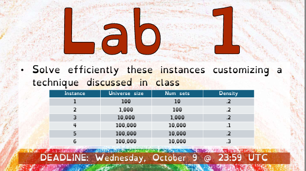

# Set Cover Problem - Lab 1

## Overview

This project solves the **Set Cover Problem**, a classical NP-complete problem in combinatorics and computational theory. The objective is to find a minimum-cost subset of sets that covers all elements in a given universe.

**Lab Requirements**:  
- Given a large **universe** of elements (`UNIVERSE_SIZE`) and a collection of **subsets** (`NUM_SETS`), the goal is to find a combination of subsets such that every element in the universe is covered by at least one subset.
- Each subset has an associated **cost**, and the goal is to **minimize the total cost** of the selected subsets.

**Input Specifications**:  
1. A binary matrix `SETS` where each row represents a subset and each column corresponds to elements in the universe.  
2. A `COSTS` array, where each entry represents the cost of including that subset in the solution.  

**Output Requirements**:  
- A list of selected subsets that cover all elements in the universe.
- The total cost of the solution.

## Problem Statement



The goal is to **find the minimum-cost subfamily of `S`** such that the union of these subsets covers `U`.

## Approach

### Greedy Approach
- Start by selecting the subset that covers the most uncovered elements per unit cost.
- Continue adding subsets until all elements in `U` are covered.

### Local Search
- Once a solution is found, refine it using local search by swapping or removing subsets to reduce cost while maintaining full coverage.

### Metaheuristics
- Apply **Iterated Local Search (ILS)** or **Tabu Search** to escape local optima and find better solutions iteratively.

## Implementation Details

### File Structure
- `set_cover.ipynb`: Main Jupyter Notebook containing the code and implementation.
- `README.md`: This file, explaining the approach and results.
- `LICENSE.md`: License details (if required).

### Running the Code
1. Clone this repository.
2. Open the `set_cover.ipynb` notebook.
3. Run each cell step-by-step to reproduce the results.

```python
# Example code snippet to demonstrate usage:
solution = greedy_initial_solution(SETS, COSTS)
print(f"Initial Solution Cost: {cost(solution)}")
